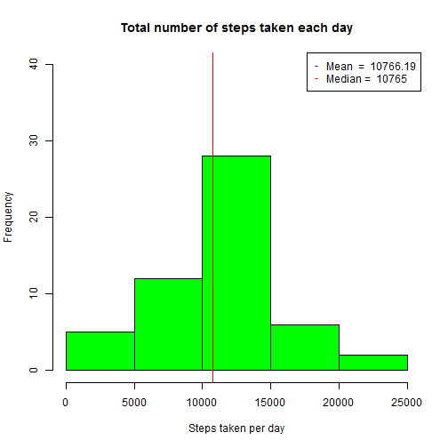
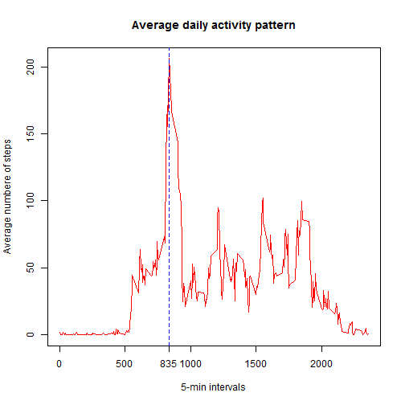
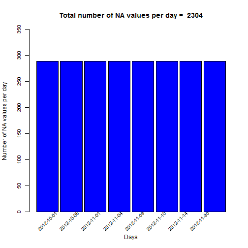
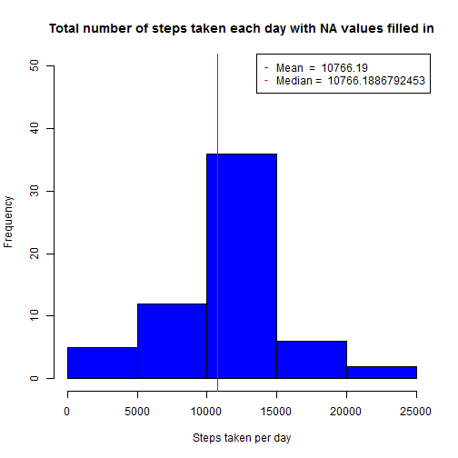
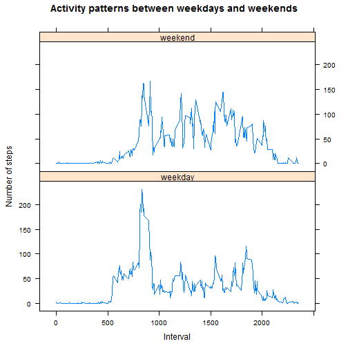

# Reproducible Research: Peer Assessment 1

## Loading and preprocessing the data


```r
## Loading the raw data
activityRawData <- read.csv("./activity.csv")

## Preprocessing the date column to convert to date column type
activityRawData$date <- as.Date(activityRawData$date, format="%Y-%m-%d")
```

## What is mean total number of steps taken per day?

The **mean** of the total number of steps taken per day is 10,766.19 steps and the **median** is 10,765; so mean and median are pretty close values.

The R code and the result are shown below:


```r
## Calculate the total number of steps taken per day
totalSteps <- aggregate(activityRawData$steps, list(day = activityRawData$date), sum)

## Create the histogram graph
hist(totalSteps$x, 
     main = "Total number of steps taken each day", 
     xlab = "Steps taken per day", 
     ylim = c(0, 40),
     col = "green")

## Adding the mean value
meanValue <- mean(totalSteps$x, na.rm = TRUE)
abline(v = meanValue, col = "blue", lwd = 1)

## Adding the median value
medianValue <- median(totalSteps$x, na.rm = TRUE)
abline(v = medianValue, col = "red", lwd = 1)

## Setting the legend box
legend("topright", 
       pch = c("-", "-"), 
       col = c("blue", "red"), 
       legend = c(paste("Mean  = ", round(meanValue,2)), paste("Median = ", medianValue)))
```



## What is the average daily activity pattern?

The **0835 interval** contains the maximum number of steps (206 steps) on average across all the days.

The R code and the result are shown below:


```r
## Excluding the NA values
missing <- is.na(activityRawData$steps)
activityData <- activityRawData[!missing,]

## Calculate the average of steps per interval across all days
totalInterval <- aggregate(activityData$steps, list(interval = activityData$interval), mean)

## Create the plot graph
plot(totalInterval$interval, 
     totalInterval$x, 
     type = "l",
     main = "Average daily activity pattern", 
     xlab = "5-min intervals",
     ylab = "Average numbere of steps",
     col = "red")

maxInterval <- totalInterval[totalInterval$x==max(totalInterval$x), "interval"]
axis(side=1, at=maxInterval)
abline(v=maxInterval, col="blue", lty=2)
```



## Imputing missing values

The total number of missing values in the dataset is **2,304**, there are 8 days with 288 missing values for each day.

The R code and the result are shown below:


```r
## Filtering only the rows with NA values
missing <- is.na(activityRawData$steps)
activityNA <- activityRawData[missing,]

## Set the value 1 to the steps column to be possible counting the amount of NA values
activityNA$steps <- 1

## Calculate the sum of NA values per day
totalNA <- aggregate(activityNA$steps, 
                     list(day = activityNA$date), 
                     sum)
row.names(totalNA) <- totalNA$day

## Reducing the text size of the axis
par("cex.axis" = 0.8)

barplot(totalNA$x, 
        ylab = "Number of NA values per day ",
        xlab = "Days",
        main = paste("Total number of NA values per day = ", sum(totalNA$x)),
        col = "blue",
        ylim = c(0, 350),
        space = 0.1)

## Seeting the text of the x axis to a 45° of inclination
text(seq(1,length(totalNA$day),by=1), 
     par("usr")[3]-0.25, 
     srt = 45, 
     adj= 1, 
     xpd = TRUE, 
     labels = paste(rownames(totalNA)), 
     cex=0.8)
```



Then, the missing values were filled in creating a new dataset. The strategy applied was the mean for that 5-minute interval. Using the new dataset a histogram was generated observing that these values differ from the estimates from the first part of the assignment. **The frecuency increased for 10,000 to 15,000 range steps taken per day, after imputing missing data.**

The R code and the result are shown below:


```r
## Filtering only the rows with not NA values
activityData <- activityRawData[!missing,]

## Calculate the average of steps per interval across all days
totalInterval <- aggregate(activityData$steps, 
                           list(interval = activityData$interval), 
                           mean)

## Merge the toal interval data set with wih the original data set 
mergeData <- merge(activityRawData, 
                   totalInterval, 
                   by.x = "interval", 
                   by.y = "interval", 
                   all = TRUE)

## Filling in all of the missing values in the dataset. 
## The strategy applied was the mean for that 5-minute interval
library(dplyr)
mergeData <- mutate(mergeData, 
                    newSteps = ifelse(is.na(mergeData$steps), mergeData$x, mergeData$steps))

## Create a new dataset that is equal to the original one but with the missing data filled in.
newactivityData <- arrange(select(mergeData, 
                                  steps = newSteps,
                                  date, 
                                  interval), 
                           date) 

## Calculate the total number of steps taken per day with NA values filled in.
totalSteps <- aggregate(newactivityData$steps, list(day = newactivityData$date), sum)

## Create the histogram graph
hist(totalSteps$x, 
     main = "Total number of steps taken each day with NA values filled in", 
     xlab = "Steps taken per day", 
     ylim = c(0, 50),
     col = "blue")

## Adding the mean value
meanValue <- mean(totalSteps$x, na.rm = TRUE)
abline(v = meanValue, col = "blue", lwd = 1)

## Adding the median value
medianValue <- median(totalSteps$x, na.rm = TRUE)
abline(v = medianValue, col = "red", lwd = 1)

## Setting the legend box
legend("topright", 
       pch = c("-", "-"), 
       col = c("blue", "red"), 
       legend = c(paste("Mean  = ", round(meanValue,2)), paste("Median = ", medianValue)))
```



## Are there differences in activity patterns between weekdays and weekends?

There are differences in activity patterns between weekdays and weekends, the higher average steps taken per day is present in weekdays (between 0800 and 0900 interval), however during the day the average steps taken per day in weekends is higher than in weekdays.

The R code and the result are shown below:


```r
## Adding the Type Day column
newactivityData <- mutate(newactivityData, 
                          typeDay = ifelse(format(date,"%w") %in% c(0,6), "weekend", "weekday"))

## Calculate the average of steps per interval across all days
totalIntervalAverage <- aggregate(newactivityData$steps, 
                                  list(interval = newactivityData$interval, typeDay = newactivityData$typeDay), 
                                  mean)

library(lattice)
q <- xyplot(x~interval | as.factor(typeDay), 
            totalIntervalAverage, 
            xlab = "Interval",
            ylab = "Number of steps",
            main = "Activity patterns between weekdays and weekends",
            type = "l",
            layout = c(1,2))
print(q)
```


